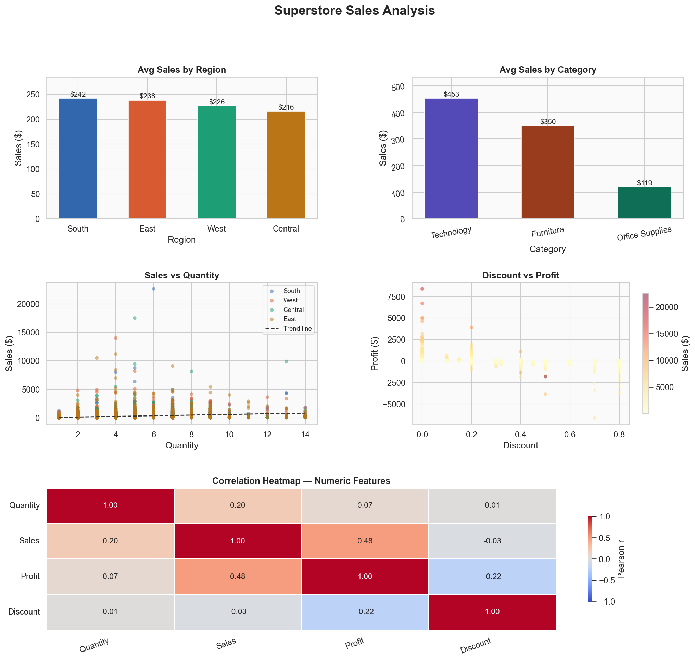

#  Sales Data Analysis & Visualization

A Python-based data analysis project that explores a retail sales dataset using **Pandas**, **NumPy**, **Matplotlib**, and **Seaborn**. The project performs data preprocessing, statistical analysis, and creates insightful visualizations to help understand sales performance.

---

##  Project Overview

This project analyzes a Superstore Sales dataset and extracts meaningful business insights by:

- Loading and cleaning the dataset
- Performing exploratory data analysis (EDA)
- Computing descriptive statistics
- Calculating average sales across different categories
- Creating professional visualizations
- Providing business recommendations based on the analysis

---

##  Features

- Dataset loading using Pandas
- Dataset inspection
- Missing value analysis
- Statistical summary
- Average Sales by Region
- Average Sales by Category
- Sales vs Quantity Scatter Plot
- Discount vs Profit Scatter Plot
- Correlation Heatmap
- Business Insights and Recommendations

---

##  Project Structure

```
01_Data_Analysis/
│
├── sales_analysis.py
├── sales_data.csv
├── sales_analysis.png
├── README.md
├── requirements.txt
└── .gitignore
```

---

##  Technologies Used

- Python
- Pandas
- NumPy
- Matplotlib
- Seaborn

---

##  Visualizations

The project generates the following charts:

-  Average Sales by Region
-  Average Sales by Category
-  Sales vs Quantity Scatter Plot
-  Discount vs Profit Scatter Plot
-  Correlation Heatmap

Example Output:



---

##  Business Insights

The analysis identifies:

- Highest-performing sales region
- Highest-performing product category
- Relationship between Sales and Quantity
- Relationship between Discount and Profit
- Average order quantity
- Average discount percentage

Based on these insights, the project also provides business recommendations for improving sales performance.

---

## ▶ Installation

Clone the repository

```bash
git clone https://github.com/yourusername/qskill-python-internship.git
```

Move to the project directory

```bash
cd qskill-python-internship/01_Data_Analysis
```

Install dependencies

```bash
pip install -r requirements.txt
```

Run the project

```bash
python sales_analysis.py
```

---

##  Dataset

Dataset: **Superstore Sales Dataset**

(Source: Kaggle)

---

##  Skills Demonstrated

- Data Analysis
- Exploratory Data Analysis (EDA)
- Data Visualization
- Business Analytics
- Python Programming
- Pandas
- NumPy
- Matplotlib
- Seaborn

---

##  Author

**Pratham Mehra**

B.Tech Computer Science Engineering  
Shiv Nadar University

---

##  License

This project is developed for educational and internship purposes.