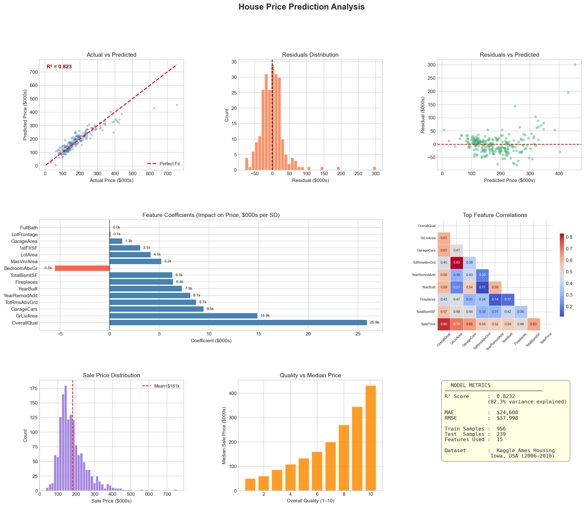

#  House Price Prediction using Linear Regression

A Machine Learning project that predicts house prices using **Linear Regression** on the Kaggle Ames Housing dataset. The project includes data preprocessing, feature engineering, model training, evaluation, and visualization of results.

---

##  Project Overview

This project builds a Linear Regression model to estimate house prices based on various house characteristics such as living area, overall quality, garage size, basement area, lot size, construction year, and more.

The workflow covers the complete machine learning pipeline from data preprocessing to model evaluation.

---

##  Features

- Load Kaggle Ames Housing Dataset
- Data Cleaning
- Missing Value Handling
- Feature Selection
- Feature Scaling
- Train-Test Split
- Linear Regression Model
- Model Evaluation
- Sample Predictions
- Professional Data Visualizations

---

##  Project Structure

```
02_House_Price_Prediction/
│
├── house_price_kaggle.py
├── train.csv
├── kaggle_house_price_regression.png
├── README.md
├── requirements.txt
└── .gitignore
```

---

##  Technologies Used

- Python
- Pandas
- NumPy
- Scikit-Learn
- Matplotlib
- Seaborn

---

##  Features Used

The model uses the following features:

- Overall Quality
- Living Area
- Garage Capacity
- Garage Area
- Basement Area
- First Floor Area
- Number of Bathrooms
- Number of Rooms
- Year Built
- Remodel Year
- Lot Area
- Fireplaces
- Bedrooms
- Lot Frontage
- Masonry Veneer Area

Target Variable:

- **SalePrice**

---

##  Model Evaluation

The project evaluates the model using:

- R² Score
- Mean Absolute Error (MAE)
- Root Mean Squared Error (RMSE)

It also displays:

- Feature Importance
- Sample Predictions
- Error Distribution

---

##  Visualizations

The project generates the following visualizations:

-  Actual vs Predicted Prices
-  Residual Distribution
-  Residuals vs Predicted
-  Feature Importance
-  Correlation Heatmap
-  Sale Price Distribution
-  Overall Quality vs Median Sale Price
-  Model Performance Summary

Example Output:



---

##  Installation

Clone the repository

```bash
git clone https://github.com/yourusername/qskill-python-internship.git
```

Move into the project directory

```bash
cd qskill-python-internship/02_House_Price_Prediction
```

Install dependencies

```bash
pip install -r requirements.txt
```

Run the project

```bash
python house_price_kaggle.py
```

---

##  Dataset

Dataset:

**House Prices - Advanced Regression Techniques**

Source:

Kaggle

https://www.kaggle.com/competitions/house-prices-advanced-regression-techniques

---

##  Skills Demonstrated

- Machine Learning
- Linear Regression
- Data Preprocessing
- Feature Engineering
- Model Evaluation
- Feature Scaling
- Data Visualization
- Python Programming
- Pandas
- NumPy
- Scikit-Learn

---

##  Author

**Pratham Mehra**

B.Tech Computer Science Engineering  
Shiv Nadar University

---

##  License

This project was developed as part of the **QSkill Python Development Internship** for educational and learning purposes.